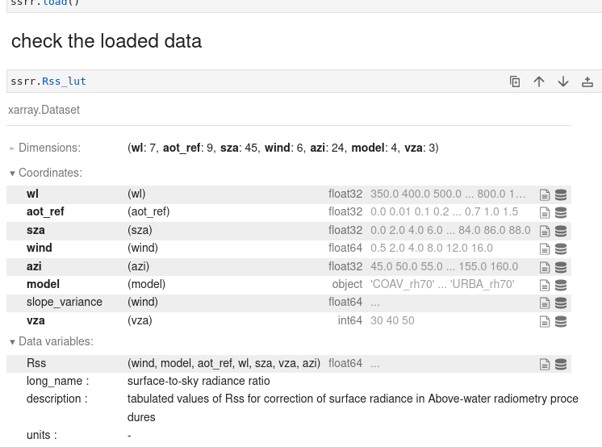
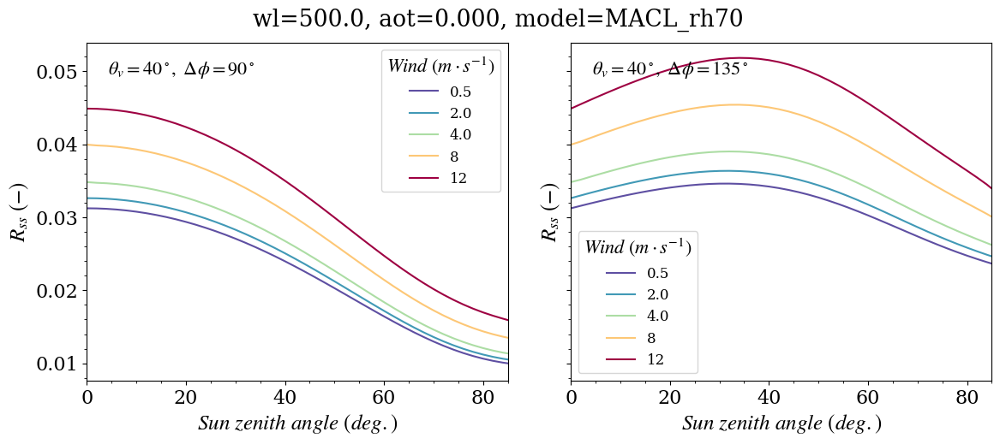

# surface_sky_radiance_ratio
### Minimal code to load and play with tabulated values for surface radiance correction in Above-Water Radiometry procedures

## Installation
First you have to clone the package.
Then, you can install the package with

pip install .

A reduced size look-up table file is provided with the package for view zenith angles 30, 40 and 50°.
If you want full simulations, you can download the netcdf accessible [here](https://drive.google.com/file/d/1rJ9RkGhNj3jEk3qmS6oGV8VdZaRzL5bO/view?usp=sharing) (warning fie size = 1.2 Go) and place it in the package folder `surface_sky_radiance_ratio/data`

Once the installation is successful, you check the notebooks for practical examples:

    

    

